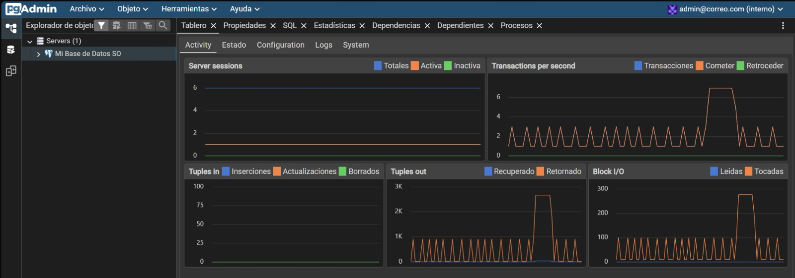
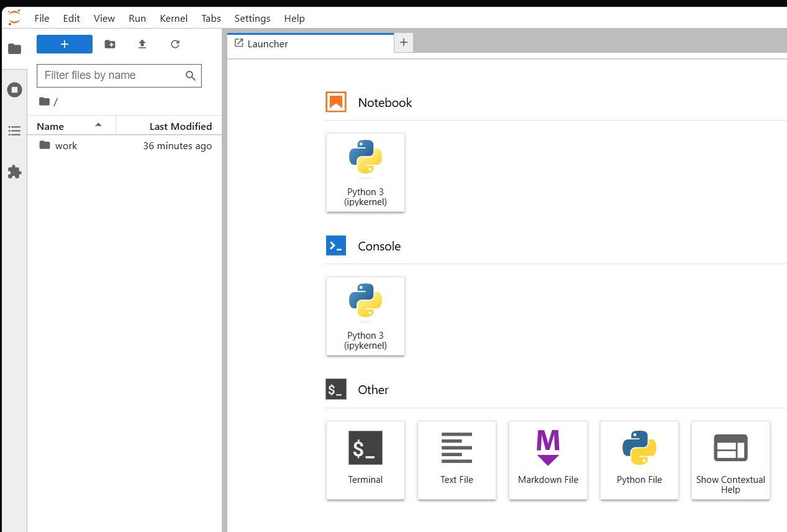

# Laboratorios de Sistemas Operativos - Docker y Linux

## Integrantes

| Nombre Completo              | Código  | Correo Institucional                                                                      |
| ---------------------------- | ------- | ----------------------------------------------------------------------------------------- |
| Adriana Milena Noscue Dagua  | 2477336 | [adriana.noscue@correounivalle.edu.co](mailto:adriana.noscue@correounivalle.edu.co)       |
| Sebastián Cucalón Astorquiza | 2477344 | [sebastian.cucalon@correounivalle.edu.co](mailto:sebastian.cucalon@correounivalle.edu.co) |

---

# Laboratorio 1 - Entorno de Desarrollo con Docker, WSL2 y Ubuntu

## Descripción

Este proyecto implementa un entorno de desarrollo basado en contenedores Docker utilizando WSL2 y Ubuntu sobre Windows. Se despliegan múltiples servicios integrados mediante Docker Compose para simular un entorno moderno de desarrollo y administración de aplicaciones.

---

## Tecnologías Utilizadas

* WSL2
* Ubuntu
* Docker
* Docker Compose
* Nginx
* Node.js
* PostgreSQL
* pgAdmin 4
* Jupyter Lab
* Git
* GitHub

---

## Arquitectura del Proyecto

```text
Windows
│
├── WSL2
│   └── Ubuntu
│
└── Docker Compose
    ├── nginx
    ├── node-app
    ├── postgres
    ├── pgadmin
    └── jupyter
```

---

## Estructura del Proyecto

```text
mi-proyecto-docker/
│
├── nginx/
├── node-app/
├── jupyter_notebooks/
├── imagenes/
├── docker-compose.yml
├── README.md
└── .env
```

---

## Instalación

### Clonar repositorio

```bash
git clone URL_DEL_REPOSITORIO
```

### Ingresar al proyecto

```bash
cd mi-proyecto-docker
```

### Levantar los contenedores

```bash
docker compose up -d
```

---

## Servicios

| Servicio    | Puerto |
| ----------- | ------ |
| Nginx       | 8080   |
| Node.js     | 3000   |
| PostgreSQL  | 5432   |
| pgAdmin 4   | 5050   |
| Jupyter Lab | 8888   |

---

## Evidencias

### Nginx funcionando


### API Node.js


### pgAdmin



### Jupyter Lab



### Contenedores Activos


---

# Laboratorio 2 - Gestión y Optimización de Procesos en Linux

## Objetivo

Monitorear, administrar y optimizar procesos en Linux utilizando herramientas de observación, control y limitación de recursos del sistema operativo.

---

## Herramientas Utilizadas

* Docker
* Ubuntu
* htop
* top
* stress
* stress-ng
* cpulimit
* ps
* pstree
* kill
* nice
* renice
* Python 3

---

## Actividades Realizadas

### 1. Reconocimiento del Entorno

Se analizaron los procesos activos mediante:

```bash
top
htop
ps aux
pstree
```

Se identificaron:

* PID
* Usuario
* Prioridad (PRI)
* Nice (NI)
* Uso de CPU
* Uso de memoria

---

### 2. Generación de Carga Artificial

#### Saturación de CPU

```bash
stress --cpu 4 --timeout 60s
```

#### Saturación de Memoria

```bash
stress --vm 2 --vm-bytes 256M --timeout 60s
```

#### Competencia entre Procesos

```bash
stress --cpu 2 &
python3 -c "while True: pass" &
dd if=/dev/zero of=/dev/null bs=1M &
```

---

### 3. Optimización e Intervención

#### Finalización de Procesos

```bash
kill PID
kill -9 PID
killall stress
```

#### Modificación de Prioridades

```bash
nice -n 19 stress --cpu 2 &
renice -n 15 -p PID
```

#### Limitación del Uso de CPU

```bash
cpulimit -p PID -l 30
```

---

## Script Utilizado

Archivo:

```text
scripts/cpu_stress.py
```

Contenido:

```python
while True:
    pass
```

---

## Evidencias

### htop en reposo


### Árbol de procesos


### Saturación de CPU


### Saturación de Memoria


### PID de mayor consumo


### Procesos compitiendo


### Cambio de prioridad NI


### Limitación con cpulimit


---

## Conclusiones

* Docker y WSL2 facilitan la creación de entornos aislados para pruebas y desarrollo.
* Linux proporciona herramientas robustas para monitorear procesos y recursos.
* El uso de kill, nice, renice y cpulimit permite optimizar el comportamiento del sistema.
* La administración adecuada de procesos mejora la estabilidad y el rendimiento del sistema operativo.

---

## Repositorio

Repositorio desarrollado para los laboratorios de Sistemas Operativos de la Universidad del Valle.

# Laboratorio de Sistemas Operativos: Entorno Multi-Servicio Controlado

## 👥 Integrante
* Estudiante: [Juan Esteban Aguirre Castañeda] 
* Codigo: [202459676]
* Plan: [3743]

## 📝 Descripción del Proyecto
Este proyecto consiste en el diseño, despliegue y administración de un entorno multi-servicio controlado basado en contenedores Docker, ejecutado de forma nativa sobre el núcleo de Linux utilizando el Subsistema de Windows para Linux (WSL2) en una distribución Ubuntu.

## 🏗️ Arquitectura del Entorno
El sistema se compone de 5 servicios aislados que coexisten en una red privada virtual de tipo `bridge` gestionada por Docker Compose:
1. **Nginx (Puerto 8080):** Servidor web que actúa como proxy.
2. **Node.js (Puerto 3000):** Servidor de aplicaciones con Express.
3. **PostgreSQL (Puerto 5432 - Interno):** Base de datos relacional con volumen persistente.
4. **pgAdmin 4 (Puerto 5050):** Panel gráfico de administración de la base de datos.
5. **Jupyter Lab (Puerto 8888):** Entorno para ciencia de datos y ejecución de notebooks.

## 📋 Requisitos Previos
* Windows 10/11 con soporte de Virtualización de CPU habilitado en BIOS.
* WSL2 con distribución Ubuntu instalada.
* Docker Desktop configurado con el motor de WSL2.
* Cuenta activa en GitHub.

## 🚀 Pasos de Instalación y Despliegue
1. Clonar este repositorio:
   ```bash
   git clone https://github.com/Jeac2506/mi-proyecto-docker.git
   cd mi-proyecto-docker
